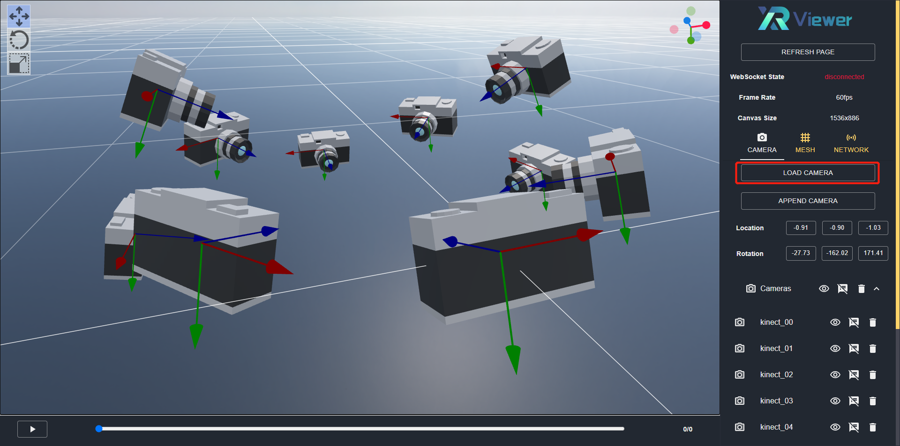
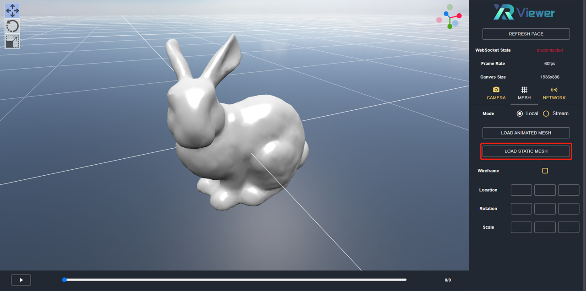
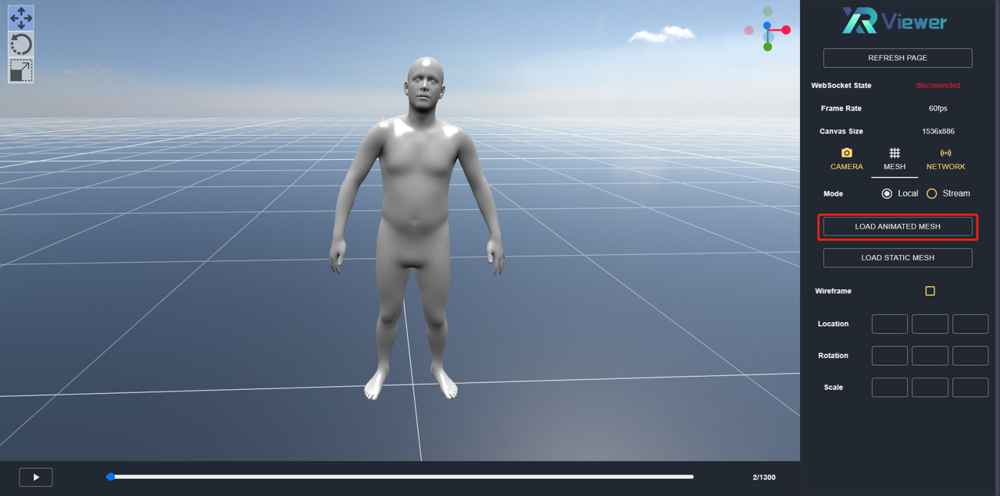

# Basic Usage

- [Camera](md-camera)
- [Mesh](md-mesh)

In this tutorial, we introduce the basic usage of the XRViewer. For convenience, we provide some example data for testing, which can be downloaded from [here](https://gitlab.bj.sensetime.com/openxrlab/xrviewer/uploads/79f90caea5e0a5d7ceb5d989ae4cb905/examples.zip).

(md-camera)=

## Camera

XRViewer supports visualizing the camera placement. The camera is generated by the XRPrimer and its parameters are packed into a .json file. To spawn cameras, click `LOAD CAMERA` button on the `CAMERA` panel and upload the camera files to the viewer:

To append new cameras to the scene, click `ADD CAMERA` button. You can also change the camera properties on the `CAMERA` panel, e.g., set camera mesh or label visibility, dispose cameras.

(md-mesh)=

## Mesh

For mesh visualization, we employ two modes to visualize meshes in different formats, namely the ***Local Mode*** and the ***Stream Mode***:

 - Local Mode: supports meshes that are **officially** supported by Babylon.js.

 - Stream Mode: supports meshes that are represented as **customized data structures** or **not officially** supported by Babylon.js.

The following table illustrates the supported file formats:

| | Local Mode | Stream Mode |
| :----: | :----: | :----: |
| Static Mesh | obj, gltf(glb), stl | - |
| Animated Mesh | gltf(glb) | fbx, alembic, npz(SMPL data) |

### Local Mode

For static meshes, select `Local` mode on the mesh panel. Then, click `LOAD STATIC MESH` and upload the corresponding file to the viewer:

For animations, click `LOAD ANIMATED MESH` and upload the file to the viewer:

The animation panel is located at the bottom of the viewer and is used to control the playing state.

### Stream Mode

Many animation file types are not officially supported by Babylon.js, including fbx, alembic, etc. Worse still, some animations are not stored as common data exchange format, e.g. the SMPL(X) animation is encoded by a set of parametric values that controls the body shape/pose deformations, which cannot be directly parsed and rendered by the web viewer.

Taking the SMPL(X) as example, the traditional workflow involves manually infer per-frame joint transforms via the SMPL(X) body model, which are further used to compute mesh deformations. Then, the sequence is either baked as a geometry cache(e.g., alembic, obj sequence) or saved as a skeletal mesh(e.g., fbx, gltf), which can be imported into 3D graphics software(e.g., Blender, Maya) for rendering.

To simplify such process, we designed and developed the `Stream` mode, which facilitates visualizing animations not supported by Babylon.js or in customized data structures. We hope it less painful for the developers and researchers to visualize their data.

To use the `Stream` mode, the stream service needs to be configured. Please refer to the [streamed animation](../streamed_animation/stream_service.md) for more details.
