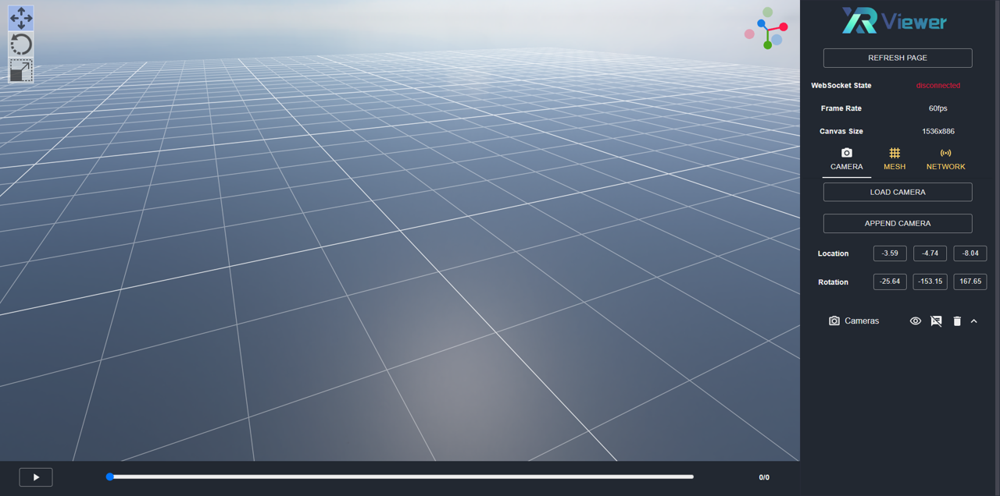

# Quick Start

- [Production Build](md-production-build)
- [Development Build](md-development-build)

In this section, we introduce how to setup the web render of the XRViewer.

The web viewer is developed using [Babylon.js](https://www.babylonjs.com/) and packaged into a [React](https://react.dev/) application utilizing [Create React App](https://create-react-app.dev/). There are two ways to setup the viewer, namely the ***production mode*** and the ***development mode***. To deploy the viewer without modifying its features, the production mode is recommended. Otherwise please setup the viewer in the development mode.

(md-production-build)=

## Production Build

For the production build, the web viewer is compiled into a static web page. You can just simply run the viewer with the python HTTP server for testing or docker image for deployment.

### Run with Python HTTP Server

Download and unzip the pre-built package from the [release page](https://gitlab.bj.sensetime.com/openxrlab/xrviewer/-/releases). Then, deploy the server using:

```shell
# setup variables
WEB_PATH="PATH/TO/PRE-BUILT/PACKAGE/"

# deploy the server
python -m http.server -d $WEB_PATH 3000
```

### Run with Docker Image

Download the docker image for the web viewer:

```sh
docker pull openxrlab/xrviewer_runtime:nginx_web
```

Setup the web deployment config under `configs/web.cfg`:

```sh
PORT=3000   # port to be exposed to visit the web page
```

Run the docker image with the config:

```sh
sudo sh scripts/run_web_docker.sh configs/web.cfg
```

(md-development-build)=

## Development Build

### Install Dependencies

The viewer source files are located at `xrviewer/web`. The `package.json` contains dependicies to build the viewer, which can be installed using Node Package Manager(`npm`). It's suggested to manage `Node.js` installations with Node Version Manager(`nvm`). The installation instructions of `nvm` can be found [here](https://heynode.com/tutorial/install-nodejs-locally-nvm/).

The viewer is built using `Node.js 18.15`. Once you have `Node.js` correctly configured, install node packages:

```shell
# make sure that your current working directory is xrviewer/web
cd xrviewer/web

# install node packages using configuration in package.json
npm install
```

### Run Viewer

Build and run the viewer using `run_viewer` in `tools/`:

```shell
# Windows
tools/start_viewer_dev.bat

# Linux
sh tools/start_viewer_dev.sh
```

To create a viewer window, open the browser and visit http://localhost:3000/:



For example usage of the viewer, please refer to [basic_usage.md](./basic_usage.md).
