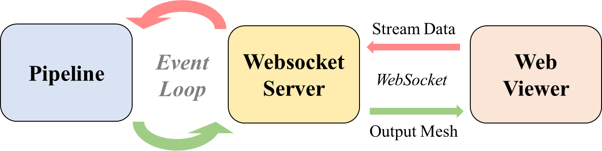
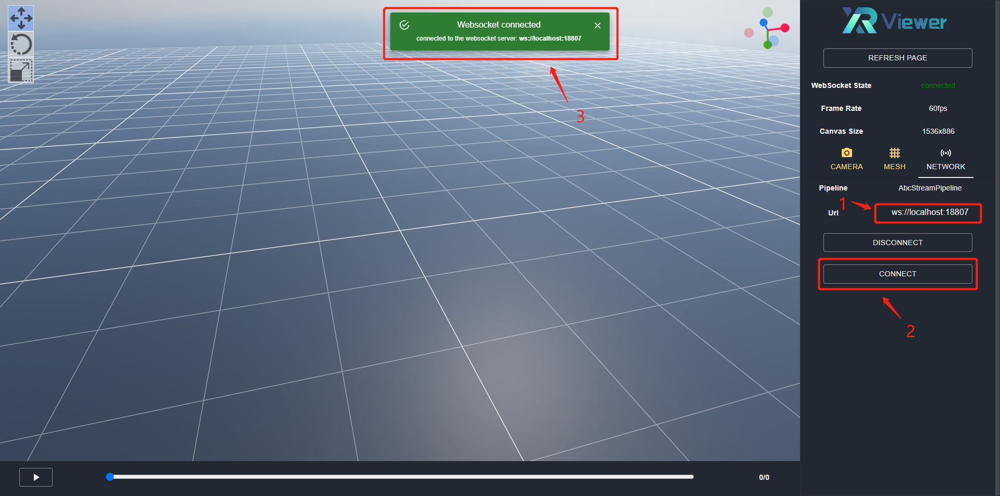
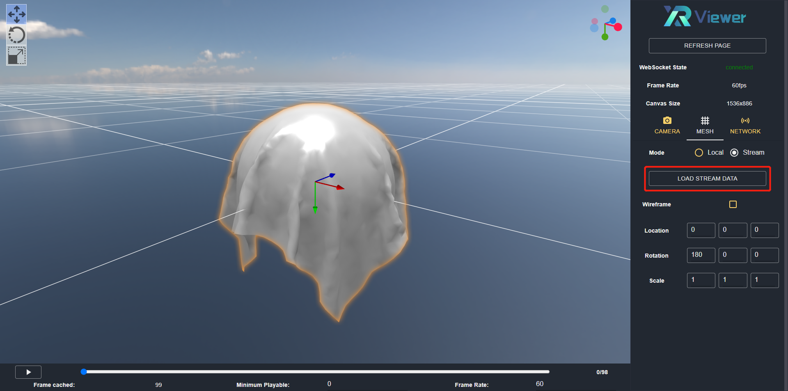

# Stream Service

- [Architecture](md-architecture)
- [Setup Stream Service](md-setup-stream-service)
- [Example Usage](md-example-usage)

To visualize animations not supported by Babylon.js or in customized data structures, we developed the stream mode. In this tutorial, we describes how the stream mode works and how to setup the stream service. Notice that if you are only interested in camera visualization or body visualization locally, this section is unnecessary.

(md-architecture)=

## Architecture

The following figure illustrates how the stream mode works:

- ***Web Viewer***. This is where the users can upload the raw mesh data and view the render output in an interactive manner. Taking the desired animation file as input, the web viewer sends it to the websocket server and receives corresponding mesh output via websocket connection. Then, the output mesh is parsed and renderered by the viewer using WebGL.

- ***Websocket Server***. The websocket server connects the pipeline backend and the viewer frontend. Specifically, the websocket server maintains the viewer state and expose it to the pipeline. The pipeline listens for the state change in the websocket server and makes response. The pipeline output is then forwarded to the web viewer for display.

- ***Pipeline***. This is where the stream data is actually parsed and converted into mesh data that is rendererable for the viewer. At the heart of the the pipeline is an event loop that continually checks the websocket server's state change. The users can either use our pre-defined pipelines or setup their own pipelines to parse customized animations. The pipeline is connected with the websocket server using a [ZeroMQ](https://zeromq.org/) socket connection.

(md-setup-stream-service)=

## Setup Stream Service

The tutorial differs on the format of animation file you want to visualize. For existing pipelines, we have 3 types of pipelines: *SMPLStreamPipeline* for SMPL(X) animation in `.npz` format, *AbcStreamPipeline* for geometry cache in `.abc` format and *FbxStreamPipeline* for skeletal mesh in `.fbx` format. You can also implement your own pipelines to visualize other animations.

Notice that for each pre-defined pipeline, we provide two ways to setup the service: *from-scratch setup* and *run with docker image*. We recommend depolying the stream service using docker.

For detailed instructions of pipelines setup, please refer to:

 - SMPLStreamPipeline: [smpl_stream_pipeline.md](./smpl_stream_pipeline.md).

 - AbcStreamPipeline: [abc_stream_pipeline.md](./abc_stream_pipeline.md).

 - FbxStreamPipeline: [fbx_stream_pipeline.md](./fbx_stream_pipeline.md)

 - CustomizedStreamPipeline: [customized_stream_pipeline.md](./customized_stream_pipeline.md).

(md-example-usage)=

## Example Usage

Once you have successfully started a pipeline, go to the `NETWORK` panel and fill in the pipeline url. Then, click the `CONNECT` button. If the server has been properly deployed, the viewer will popup a widget messaging that the websocket is connected.

To load stream data, make sure that you have selected `Stream` mode on the animation panel. Then, click `LOAD STREAM DATA` button and upload the stream data to the viewer:

At the bottom of the viewer is the animation panel that controls the body movement, e.g., set the playing state, manipulate the frame rate.
